
This is an Ecommerce app using ASP .NET CORE MVC and ANGULAR 9. Anyone wishing to learn from the project can refer to the code and pattern.

<strong>Technologies used:</strong>

<ul>
<li>Angular Lazy loading</li>
<li>Angular Routing</li>
<li>Angular Reactive Forms</li>
<li>Payment gateway integration</li>
<li>Angular Re-usable Reactive form components</li>
<li>Angular validation</li>
<li>Async Validation</li>
<li>.Net Core</li>
<li>Angular</li>
<li>C# Generics</li>
<li>Repository Pattern</li>
<li>Unit of Work Pattern</li>
<li>Specification Pattern</li>
</ul>

<strong>Project overview</strong>

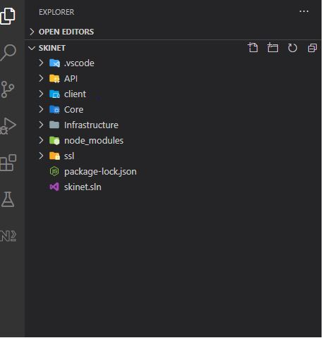

API contains:

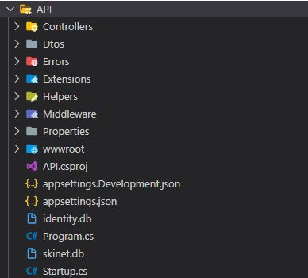

Client (Angular project) contains:

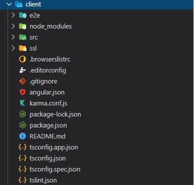

Also, the project is divided into Core and Infrastructure:

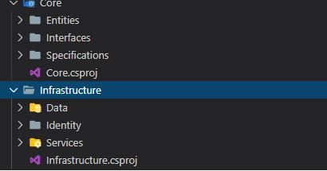
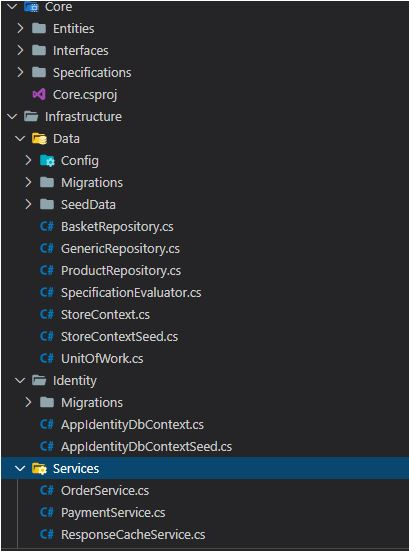
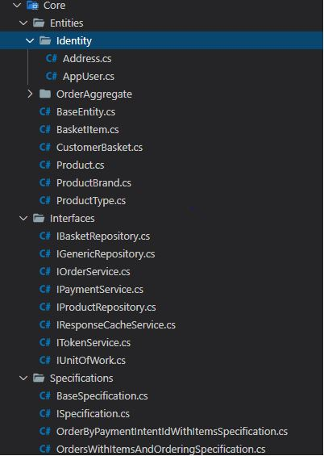

<strong>Client</strong>

This project is developed with Angular CLI version 9.0.1.

<strong>Development server</strong>

The API of the project is developed using ASP .NET Core 3.1/

<strong>Server Side Technologies</strong>

<ul>
<li>.Net Core</li>
<li>Generic Repository Patterns</li>
<li>Unit of Work Pattern</li>
<li>Specification Pattern</li>
<li>Azure Redis Cache</li>
<li>Sqlite for devlopment</li>
<li>Swagger</li>
<li>Stripe Implementation</li>
</ul>

<strong>Client Side Technologies</strong>

<ul>
<li>Angular 9</li>
<li>Bootstrap 4</li>
<li>ngx-bootstrap</li>
<li>Font Awesome</li>
<li>Lazy Loading</li>
<li>Caching</li>
<li>RXJS</li>
<li>Design Components.</li>
</ul>

<strong>Stripe Payment Testing</strong>

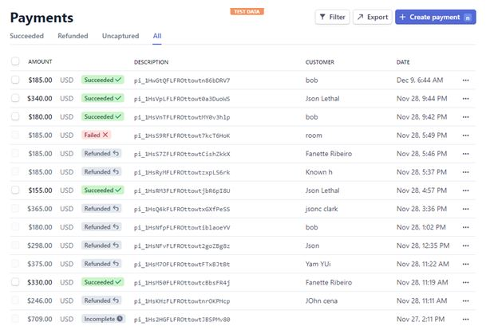

<strong>Snapshot of working website</strong>

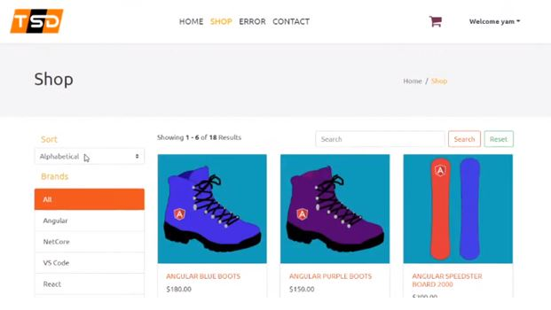
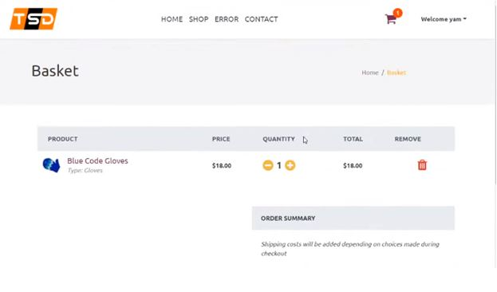
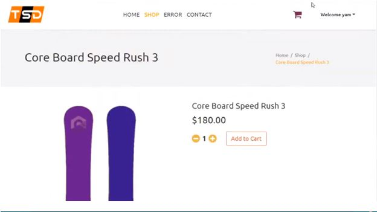
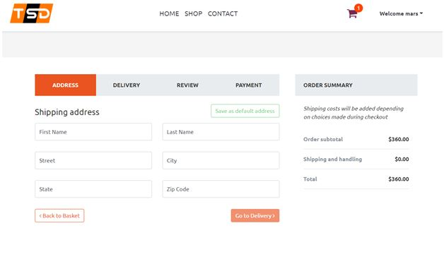
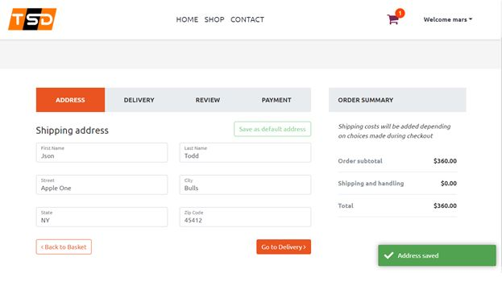
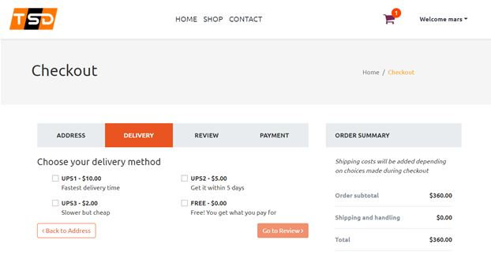
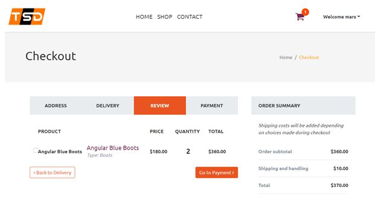
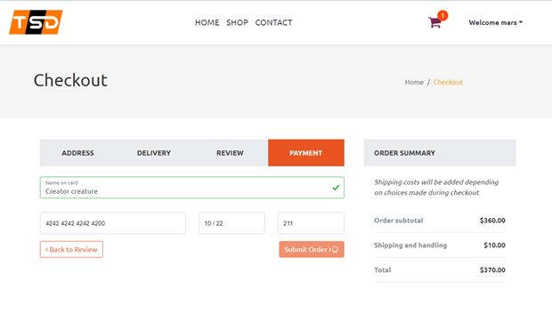
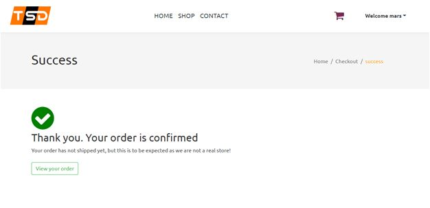
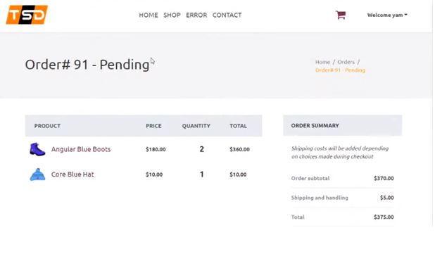

<strong>&nbsp;</strong>

<strong>&nbsp;</strong>

<strong>Video featuring the website</strong>

<a href="https://www.youtube.com/watch?v=crwidqBhxn0&amp;list=PLdnJA9a974OUDQCxO-UNSaQqdBhyDutMk">CLICK HERE FOR THE PLAYLIST</a>

<strong>Credits:</strong>

Neil Cummins

